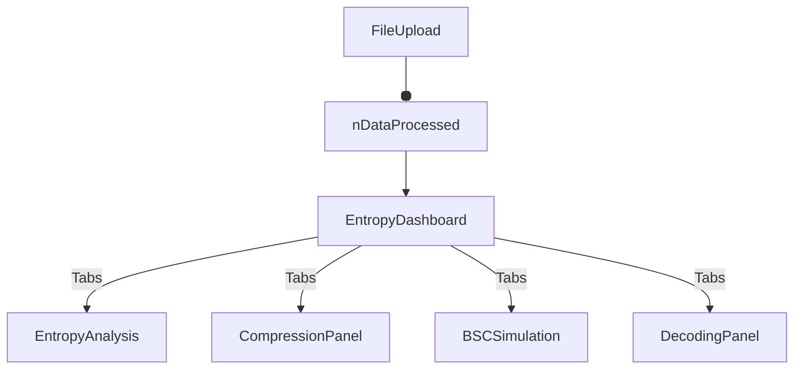

# 📚 Project Documentation

This documentation covers all files provided in your codebase, describing their roles, logic, and usage. It highlights the architecture, the flow of data, and offers insights into the design decisions, especially around UI, state management, and core algorithms for entropy analysis and data compression.

---

## `globals.css`

This file defines the global styles for the application, leveraging **TailwindCSS** and custom CSS variables for a cyberpunk arcade theme.

- **Color Variables**: Uses `oklch` color space for high-contrast backgrounds, foregrounds, and accent colors.
- **Dark Mode**: `.dark` class toggles to a different set of variables for UI adaptation.
- **Fonts**: Arcade-inspired fonts with fallbacks.
- **Animation Keyframes**: Defines arcade-like effects (`scanline`, `glitch`, `neon-glow`, etc.).
- **Utility Classes**: Includes `.game-border`, `.pixel-corners`, `.neon-text`, etc., for arcade effects.

```css
:root {
  --background: oklch(0.06 0.01 260);
  --foreground: oklch(0.98 0.02 100);
  /* ...many more */
}
.neon-text {
  animation: neon-glow 3s ease-in-out infinite;
}
```

---

## `components.json`

This is a configuration file for [Shadcn UI](https://ui.shadcn.com/) components.

- **Style**: Uses "new-york" style.
- **Tailwind**: Integrates with `globals.css` and enables CSS variables.
- **Aliases**: Custom import paths for `@/components`, `@/lib/utils`, etc.
- **Icon Library**: Uses "lucide" icons.

```json
{
  "style": "new-york",
  "tsx": true,
  "tailwind": { "css": "app/globals.css", "cssVariables": true },
  "aliases": { "components": "@/components", ... },
  "iconLibrary": "lucide"
}
```

---

## `package.json`

Defines the project's dependencies, scripts, and metadata.

- **Framework**: Next.js 15, React 19.
- **Styling**: TailwindCSS, postcss.
- **UI/UX**: Radix, Shadcn UI, Lucide icons.
- **Data Viz**: recharts, embla-carousel.
- **Forms**: react-hook-form, zod for validation.

```json
{
  "scripts": {
    "build": "next build",
    "dev": "next dev",
    "lint": "eslint ."
  },
  "dependencies": {
    "next": "15.2.4",
    "react": "^19",
    "tailwindcss": "^4.1.9",
    /* ... */
  }
}
```

---

## `postcss.config.mjs`

Configures PostCSS to use TailwindCSS.

```js
const config = {
  plugins: {
    '@tailwindcss/postcss': {},
  },
}
export default config
```

---

## `pnpm-lock.yaml`

A lockfile tracking exact versions of dependencies for reproducible builds (used by pnpm).

---

## `next.config.mjs`

Next.js project configuration:

- **React Strict Mode**: Enabled.
- **SWC Minifier**: For faster builds.
- **ESLint and TypeScript**: Ignores errors during builds.
- **Images**: Unoptimized by default.
- **Experimental**: Optimizes package imports for Radix and Lucide.

```js
const nextConfig = {
  reactStrictMode: true,
  swcMinify: true,
  eslint: { ignoreDuringBuilds: true },
  typescript: { ignoreBuildErrors: true },
  images: { unoptimized: true },
  experimental: {
    optimizePackageImports: ["@radix-ui/react-*", "lucide-react"],
  },
}
export default nextConfig
```

---

## `.gitignore`

Specifies untracked files/folders:

- Node modules, build outputs, debug logs.
- .env files, Vercel deployment files, TypeScript build info.

---

## `layout.tsx`

Defines the root layout for all pages in the app:

- **Font**: Loads "Geist Mono" and arcade font.
- **Analytics**: Includes Vercel analytics.
- **Children**: Renders all page content within a `<body>`.

```tsx
export default function RootLayout({ children }) {
  return (
    <html lang="en">
      <head>
        <link href="..." rel="stylesheet" />
      </head>
      <body className={`${geistMono.className} antialiased`}>
        {children}
        <Analytics />
      </body>
    </html>
  )
}
```

---

## `tsconfig.json`

TypeScript configuration for the Next.js project:

- Supports JSX, strict type checking, modern module resolution.
- Path aliases for `@/*`, incremental builds.

---

## `page.tsx`

The home page—renders the **EntropyDashboard** and provides the main entry to the app.

```tsx
export default function Home() {
  return (
    <main className="min-h-screen bg-background">
      <EntropyDashboard />
    </main>
  )
}
```

---

## `pmf-chart.tsx`

A React component to visualize the **Probability Mass Function (PMF)** using Recharts:

- **Props**: Accepts `ProcessedData`.
- **Chart**: Bar chart with custom color palette.
- **Tooltip**: Custom tooltip for data points.

---

## `compression-panel.tsx`

Component for **comparing compression algorithms** (Huffman vs Shannon-Fano):

- **UI Flow**:
  1. User clicks "Compare Algorithms".
  2. Shows average code lengths, efficiency, computation time.
  3. Displays code samples.
  4. Allows download of compressed file.
- **Logic**: Uses `compareCompressionAlgorithms` and `downloadCompressedFile`.

---

## `bsc-simulation.tsx`

Simulates a **Binary Symmetric Channel (BSC)**:

- **Inputs**: Flip probability and random seed.
- **Computation**: Calls `simulateBSC` for bit flips, decoding.
- **Output**: Shows entropy values, decoded text preview, and simulation info.

---

## `entropy-analysis.tsx`

Displays **entropy analysis** of uploaded text data:

- **Metrics**: Shows entropy, relative entropy, total chars.
- **Top Frequencies**: Visualizes top character frequencies.
- **PMF Chart**: Integrates `PMFChart`.
- **Export**: Buttons to download CSV or report.

---

## `decoding-panel.tsx`

Allows users to **load and decode compressed files**:

- **File Upload**: Accepts `.txt` files.
- **Decoding**: Uses `decodeCompressedFile`.
- **Output**: Shows decoded text, error, or success message.
- **Download**: Save decoded text.

---

## `file-upload.tsx`

Handles **text file uploads** for processing:

- **UI**: File selector and "Process" button.
- **Processing**: Reads file, maps characters, calculates PMF/entropy, sends data up via `onDataProcessed`.

---

## `entropy-dashboard.tsx`

Main dashboard for **entropy and compression analysis**:

- **Tabs**: Analysis, Compression, BSC Simulation, Decode.
- **State**: Tracks `ProcessedData` after file upload.
- **Layout**: Responsive arcade-themed layout.

**Mermaid Flowchart**:



---

## `theme-provider.tsx`

Wraps the app in a `next-themes` provider for dark/light mode support.

---

## UI Primitives (accordion.tsx, alert-dialog.tsx, breadcrumb.tsx, badge.tsx, ...)

A large set of files implementing **Radix UI primitives** with custom styles and utility helpers. They wrap Radix primitives, add Tailwind and custom classes, manage slots and variants, and create a consistent design system.

- **accordion.tsx**: Accordion UI.
- **alert-dialog.tsx**: Alert dialogs.
- **breadcrumb.tsx**: Breadcrumb navigation.
- **badge.tsx**: Status/label badges.
- **button-group.tsx**: Grouped button UIs.
- **avatar.tsx**: User avatar.
- **button.tsx**: Button with variants (default, outline, ghost, etc).
- **calendar.tsx**: Calendar date picker.
- **aspect-ratio.tsx**: Maintains aspect ratios for elements.
- **alert.tsx**: Alert messages.
- **card.tsx**: Card container UI.
- **carousel.tsx**: Carousel with Embla.
- **checkbox.tsx**: Checkbox UI.
- **command.tsx**: Command palette dialog.
- **context-menu.tsx**: Right-click context menus.
- **collapsible.tsx**: Collapsible content panel.
- **dropdown-menu.tsx**: Dropdown menu UI.
- **empty.tsx**: Empty state UI.
- **chart.tsx**: Chart container for Recharts.
- **dialog.tsx**: Modal dialogs.
- **drawer.tsx**: Drawer component (sliding panels).
- **input-otp.tsx**: OTP (One-Time Password) input.
- **input.tsx**: Styled input field.
- **field.tsx**: Fieldset and group helpers for forms.
- **form.tsx**: React-Hook-Form provider and field helpers.
- **kbd.tsx**: Keyboard key indicator.
- **hover-card.tsx**: Hover info popup.
- **item.tsx**: List item with media/content.
- **menubar.tsx**: Menu bar at top of app.
- **input-group.tsx**: Grouped input field with buttons or add-ons.
- **label.tsx**: Input label.
- **pagination.tsx**: Pagination controls.
- **radio-group.tsx**: Radio button group.
- **progress.tsx**: Progress bar.
- **popover.tsx**: Popover panel.
- **navigation-menu.tsx**: Navigation menu.
- **separator.tsx**: Horizontal/vertical separator.
- **sidebar.tsx**: Responsive sidebar.
- **select.tsx**: Select dropdown.
- **scroll-area.tsx**: Custom scroll area.
- **sheet.tsx**: Sliding panel ("sheet") UI.
- **resizable.tsx**: Resizable panel group.
- **skeleton.tsx**: Loading skeleton.
- **spinner.tsx**: Loading spinner.
- **sonner.tsx**: Toast/notification provider.
- **slider.tsx**: Range slider.
- **table.tsx**: Table UI.
- **tabs.tsx**: Tabbed panels.
- **toggle-group.tsx**: Toggle button group.
- **switch.tsx**: Switch UI.
- **toaster.tsx**: Toast/notification container.
- **textarea.tsx**: Text area input.
- **tooltip.tsx**: Tooltip UI.
- **toggle.tsx**: Toggle button.
- **toast.tsx**: Toast/notification primitives.

---

## Hooks (`use-mobile.tsx`, `use-toast.ts`)

### `use-mobile.tsx` / `use-mobile.ts`

Detects if the app is running on a mobile device by tracking window width.

```js
export function useIsMobile() {
  const [isMobile, setIsMobile] = React.useState<boolean | undefined>(undefined)
  React.useEffect(() => {
    // ... listens to window resize
  }, [])
  return !!isMobile
}
```

---

### `use-toast.ts`

Implements a toast notification system inspired by `react-hot-toast`:

- **State**: Keeps toasts in memory, dispatches actions.
- **APIs**: `toast({ title, description })`, `dismiss(toastId)`.
- **Reducer**: Handles `ADD_TOAST`, `UPDATE_TOAST`, `DISMISS_TOAST`, `REMOVE_TOAST`.

---

## Shared Core Types (`types.ts`)

Defines the shape of data used across the application:

```ts
export interface ProcessedData {
  fileName: string
  text: string
  mappedChars: string[]
  alphabet: string[]
  counts: Record<string, number>
  pmf: Record<string, number>
  totalChars: number
  entropy: number
  relativeEntropy: number
}
export interface CompressionResult { ... }
export interface BSCResult { ... }
```

---

## Core Utilities

### `bsc-utils.ts`

Simulates a **Binary Symmetric Channel** for bit-level noise:

- **`simulateBSC`**: Encodes text as bits, flips bits with probability `p`, decodes bits to chars, computes joint/conditional entropy, and returns a `BSCResult`.

```mermaid
flowchart TD
    A[Original Text] --> B[6-bit Encoding]
    B --> C[Bit Flips (BSC)]
    C --> D[6-bit Decoding]
    D --> E[Entropy Calculations]
```

---

### `entropy-utils.ts`

Handles text file preprocessing for entropy analysis:

- **ALPHABET**: Uses a fixed 64-character alphabet (a-z, A-Z, 1-9, space, comma, period).
- **mapChar**: Maps unknown chars to space.
- **processTextFile**: Maps, counts, calculates PMF, entropy, and relative entropy.

---

### `compression-utils.ts`

Provides **Huffman** and **Shannon-Fano** compression:

- **buildHuffmanCodes**: Builds Huffman tree and codebook.
- **buildShannonFanoCodes**: Recursively splits items, assigns codes.
- **compareCompressionAlgorithms**: Benchmarks both, selects most efficient.
- **decodeCompressedFile**: Decodes a custom compressed text file using its codebook.

---

### `download-utils.ts`

Facilitates **downloading** of data:

- **downloadCSV**: Saves PMF as CSV.
- **downloadReport**: Saves entropy/frequency report as TXT.
- **downloadCompressedFile**: Saves compressed file as TXT with JSON structure.

---

### `utils.ts`

Utility for class name composition, combining `clsx` and `tailwind-merge` for TailwindCSS class deduplication.

---

## 🔑 Summary Table

| File                    | Purpose                                                                 |
|-------------------------|-------------------------------------------------------------------------|
| `globals.css`           | Global styling, theme variables, arcade effects                         |
| `components.json`       | Shadcn/Component system config                                          |
| `package.json`          | Project dependencies and scripts                                        |
| `postcss.config.mjs`    | PostCSS setup for Tailwind                                              |
| `pnpm-lock.yaml`        | Dependency lockfile                                                     |
| `next.config.mjs`       | Next.js config                                                          |
| `.gitignore`            | Ignore rules for VCS                                                    |
| `layout.tsx`            | Root layout, head, font, analytics                                      |
| `tsconfig.json`         | TypeScript config                                                       |
| `page.tsx`              | Home page, renders dashboard                                            |
| `pmf-chart.tsx`         | PMF bar chart visualization                                             |
| `compression-panel.tsx` | Compression comparison UI                                               |
| `bsc-simulation.tsx`    | Binary Symmetric Channel simulation                                     |
| `entropy-analysis.tsx`  | Entropy report/visualization                                            |
| `decoding-panel.tsx`    | Compressed file decoder UI                                              |
| `file-upload.tsx`       | File upload and preprocess                                              |
| `entropy-dashboard.tsx` | Main UI controller/tabbed dashboard                                     |
| `theme-provider.tsx`    | Theme switcher                                                          |
| UI Primitives           | Radix UI + Tailwind custom UI parts                                     |
| Hooks                   | Mobile detection, toast management                                      |
| Core Utils              | Entropy, BSC sim, compression, downloads                                |
| `types.ts`              | Data structures for processed/compressed data                           |
| `utils.ts`              | Class name merging helper                                               |

---

## 🏁 Final Notes

- The application is a **retro arcade-themed tool** for entropy analysis, compression comparison, and noisy channel simulation.
- The **architecture** is modular, leveraging modern React, TypeScript, and a strong design system.
- **No REST API endpoints** are defined here—all logic is client-side.

If you need more detailed explanation on a specific component or logic flow, let me know!
